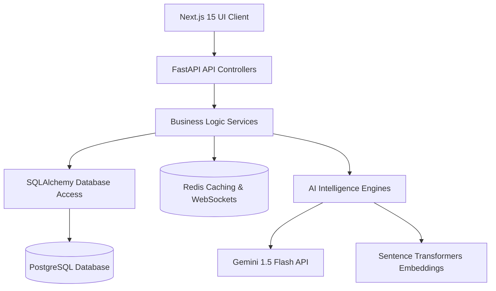
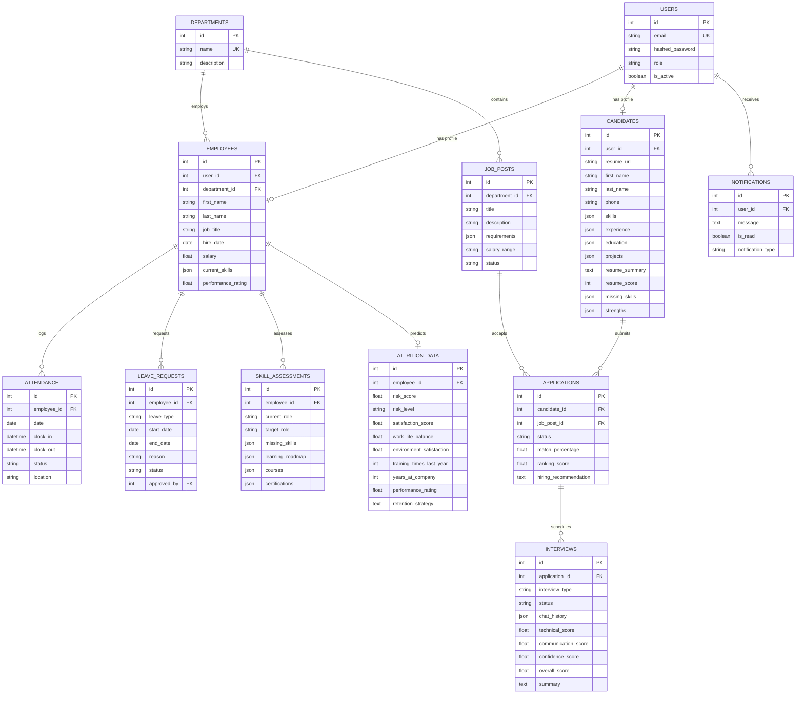

# AI Talent Intelligence HRMS - Build the Future of HR

A next-generation enterprise-grade Human Resource Management System (HRMS) powered by Artificial Intelligence. It streamlines talent acquisition, candidate screening, voice interviews, workforce tracking, attrition forecasting, and analytical business insights.

---

## 🏗️ System Architecture

The project is designed using **Clean Architecture** principles, enforcing separation of layers across the front-end (Next.js 15) and back-end (FastAPI):



- **API Layer**: Exposes secure asynchronous HTTP routes and live WebSockets.
- **Service Layer**: Coordinates business transactions, alerts, and caching.
- **AI Layer**: Houses specific intelligence routines (resume extraction, cosine similarity rankings, speech evaluations).
- **Repository Layer**: Async query abstractions using PostgreSQL and Redis caches.

---

## 📊 Database Schema (Entity-Relationship Diagram)



---

## 🤖 AI Feature Inner Workings

### 1. Resume Intelligence Engine
- **Files**: [resume_engine.py](file:///c:/ALL/HR/backend/app/ai/resume_engine.py)
- **Routines**: Text is extracted from uploaded PDF documents using `pdfplumber` / `PyPDF2` fallbacks. The system feeds the raw text into Gemini (`gemini-1.5-flash`) with a strict schema prompt. Gemini extracts details (skills, work history, projects, education) and returns parsed JSON to save directly to the database.

### 2. Candidate Ranking Engine
- **Files**: [ranking_engine.py](file:///c:/ALL/HR/backend/app/ai/ranking_engine.py)
- **Routines**: Compares Candidate's skills/experience structures against the Job Description. It encodes texts using Hugging Face's `all-MiniLM-L6-v2` locally and computes a **Cosine Similarity** score. This score represents the semantic alignment percentage. The engine then prompts Gemini to generate a hiring recommendation explaining the compatibility.

### 3. AI Conversational Recruiter
- **Files**: [conversational_recruiter.py](file:///c:/ALL/HR/backend/app/ai/conversational_recruiter.py)
- **Routines**: Generates 3-5 technical questions tailored to the candidate's skills and the role using Gemini. Guides the candidate through chat dialogue screens.

### 4. AI Voice Interview Agent
- **Files**: [voice_interview.py](file:///c:/ALL/HR/backend/app/ai/voice_interview.py)
- **Routines**: The frontend records candidate answers via the browser's native `SpeechRecognition` API (STT) and reads out questions using `SpeechSynthesis` (TTS) to mimic a verbal interview. Transcripts are sent to the FastAPI backend, where a rubric is fed to Gemini to score the candidate's technical correctness, communication clarity, and confidence.

### 5. Skill Gap Analyzer
- **Files**: [skill_gap.py](file:///c:/ALL/HR/backend/app/ai/skill_gap.py)
- **Routines**: Compares an employee's current skills against a target role (e.g. Developer -> Solutions Architect). Gemini determines missing skill benchmarks, plots a step-by-step career path, and suggests relevant certifications and courses.

### 6. Employee Attrition Predictor
- **Files**: [attrition_predictor.py](file:///c:/ALL/HR/backend/app/ai/attrition_predictor.py)
- **Routines**: Combines a mathematical attrition index (simulating Random Forest feature weights mapping satisfaction, work-life balance, environment ratings, tenure, and training) with Gemini-generated retention plans.

### 7. HR Analytics Copilot
- **Files**: [analytics_copilot.py](file:///c:/ALL/HR/backend/app/ai/analytics_copilot.py)
- **Routines**: Translates natural language questions ("Who should be promoted?") into data-driven insights. It aggregates statistics across all database tables (headcount, ratings, attrition scores) and passes this context to Gemini, generating recommendations in formatted markdown.

---

## ⚡ Deployment & Setup Guide

### Prerequisites
- Install **Docker** and **Docker Compose**.
- Obtain a **Gemini API Key** from [Google AI Studio](https://aistudio.google.com/).

### Standard Launch (1-Click Run)

1. Create a `.env` file in the root directory:
   ```env
   GEMINI_API_KEY=your_gemini_api_key_here
   ```

2. Spin up the containers:
   ```bash
   docker-compose up --build
   ```

3. Open your browser:
   - **Frontend UI**: [http://localhost:3000](http://localhost:3000)
   - **Backend API Docs**: [http://localhost:8000/docs](http://localhost:8000/docs)

*Note: The database automatically initializes tables and populates realistic mock data on startup if empty, including 1-click login profiles for testing.*

### Demo Sandbox Logins (Credentials)
We provide one-click buttons on the login screen, or you can use:
- **Admin**: `admin@hrms.com` / `admin123`
- **CEO**: `ceo@hrms.com` / `ceo123`
- **Senior Manager**: `manager@hrms.com` / `manager123`
- **HR Recruiter**: `recruiter@hrms.com` / `recruiter123`
- **Employee**: `employee@hrms.com` / `employee123`
- **Candidate**: `candidate@hrms.com` / `candidate123`.  

AI Talent Intelligence HRMS is a next-generation AI-powered platform designed to revolutionize recruitment and workforce management through intelligent automation and predictive analytics. It delivers a scalable, enterprise-ready solution for the future of Human Resources.